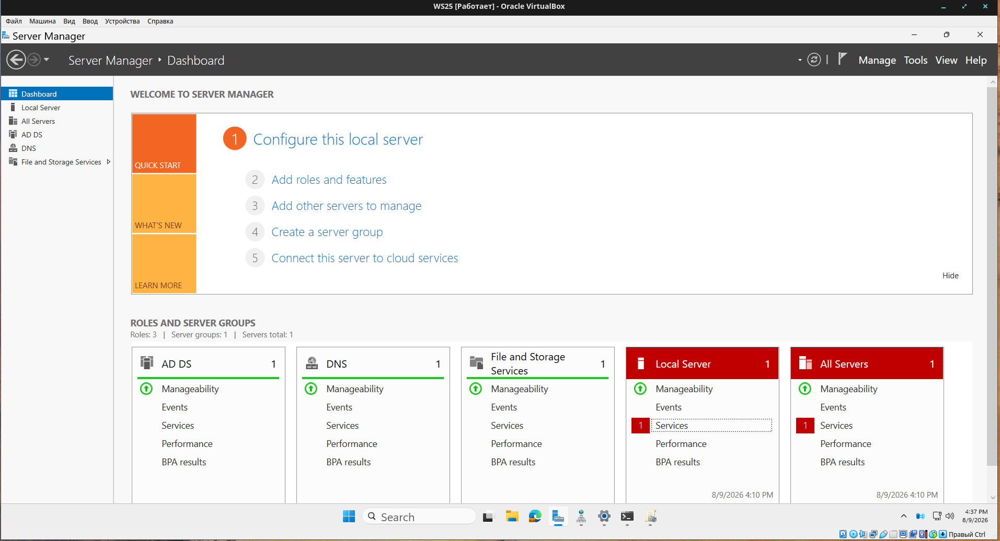
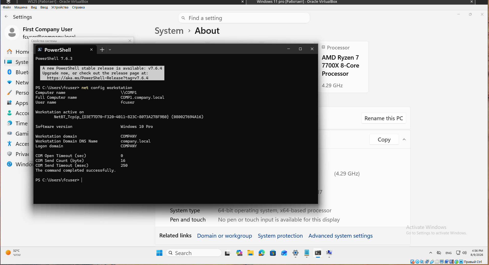
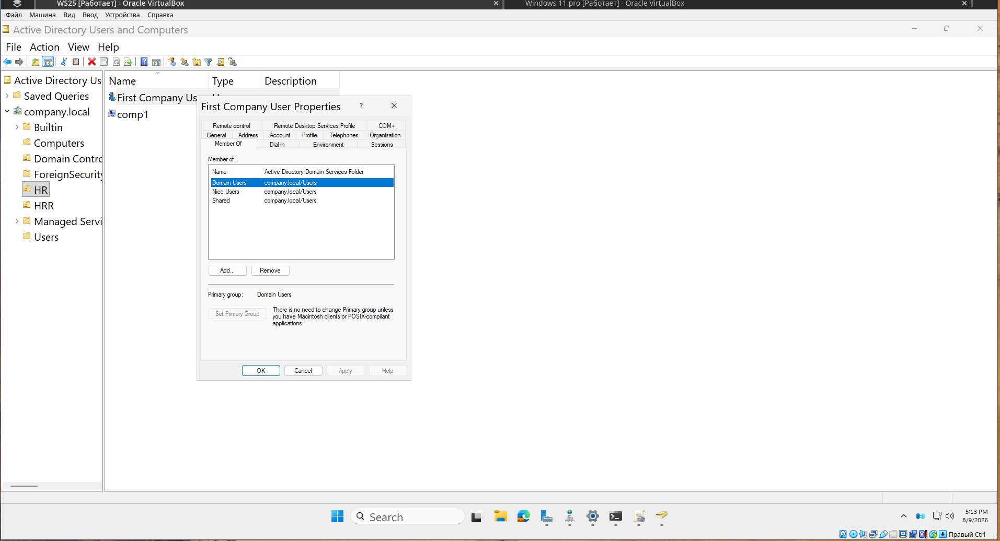
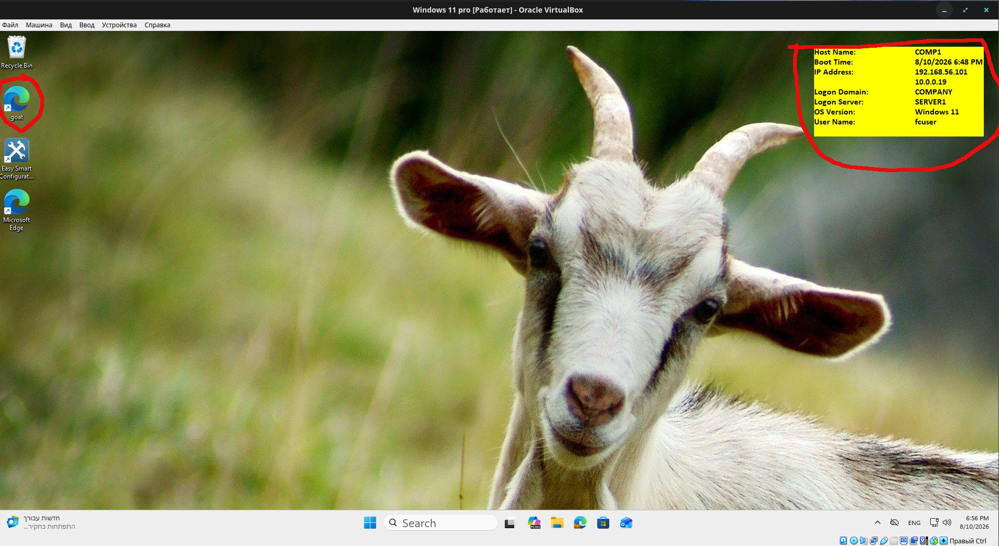
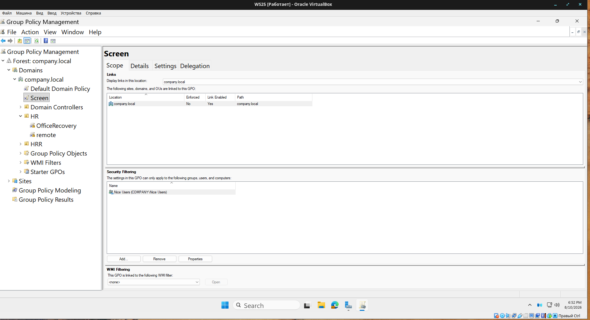
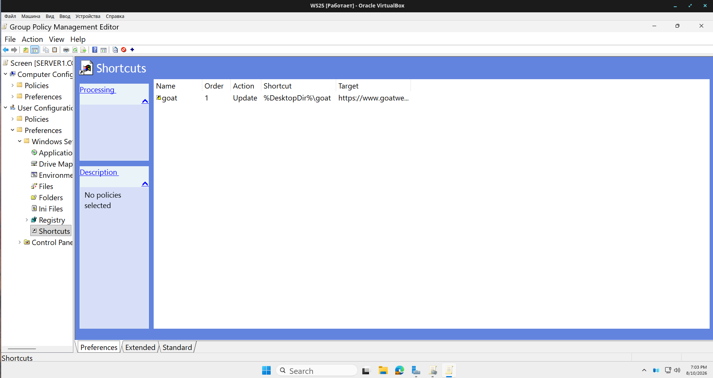
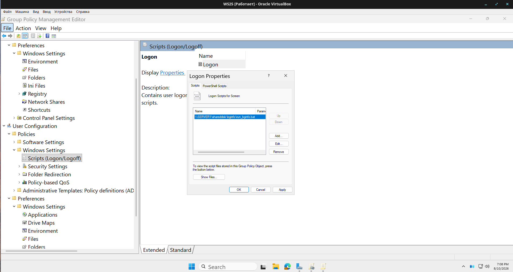

# Windows Domain Controller and Group Policy Lab

A small Windows domain built from scratch to learn Active Directory Domain Services and Group Policy hands-on rather than from courseware. One domain controller, one joined client, and a set of Group Policy Objects that standardise the desktop for a specific security group.

## Why

Every Help Desk and NOC posting I read lists Active Directory and Group Policy as a hard requirement. Reading about them is not the same as watching a policy fail to apply and having to work out why. This lab exists so that when someone asks whether I have managed users in AD, the answer is a screenshot instead of a certificate.

## Environment

| Component | Detail |
|---|---|
| Hypervisor | Oracle VirtualBox |
| Domain controller | Windows Server 2025 |
| Client | Windows Pro workstation, joined to the domain |
| Directory service | Active Directory Domain Services, new forest |
| Networking | VirtualBox internal network, static IP on the DC, client resolving the domain through it |

Both machines run on one host. The client uses the domain controller as its DNS server, which is what makes domain join and policy retrieval work at all. It is also the first thing that breaks if you get it wrong.

---

## 1. Domain controller

Installed Windows Server 2025 as a VirtualBox VM, gave it a static address, added the Active Directory Domain Services role and promoted the server to a domain controller, creating a new forest.

Verified the promotion: SYSVOL and NETLOGON shares present, the DC discoverable, the domain resolvable from the client.

> Server Manager with the AD DS role installed
> 

## 2. Domain join

Pointed the Windows Pro client at the domain controller for DNS, joined it to the domain, and confirmed login with a domain account rather than a local one.

> Showing the domain name instead of a workgroup.
> 

## 3. Users and groups

Created domain user accounts and security groups in Active Directory , and managed group membership. The group is the targeting mechanism for policy: membership decides who gets the desktop configuration, not the machine.

> Active Directory with the security group open on the Members tab.
> 

## 4. Group Policy

Authored and linked Group Policy Objects applying to one target security group:

- **Enforced desktop wallpaper.** Every member of the group gets the same background, set centrally.
- **Deployed shortcut.** A specific shortcut is placed on each group member's desktop.
- **Machine and account information on the desktop.** Host and account details are displayed on the desktop background, so a support call starts with the user reading what is already on their screen instead of hunting through system properties.

> How it looks like on user`s desktop
> 

> Group Policy Management showing the GPO linked, with Security Filtering scoped to the target group
> 

> Group Policy editor - shortcut
> 

> Group Policy editor - logon script
> 
